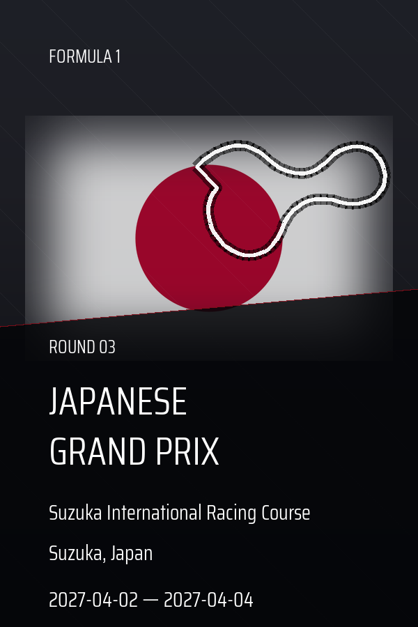
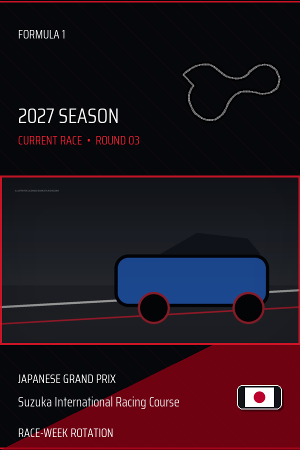
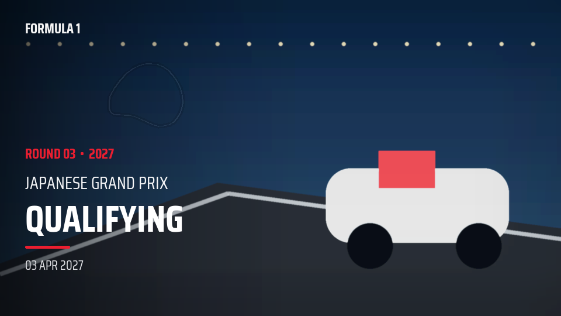
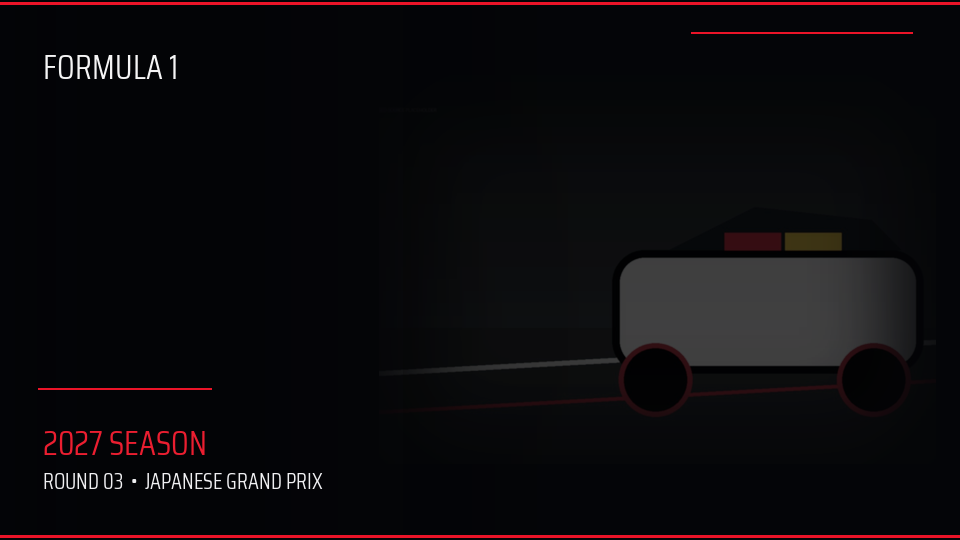

# Formula 1 extension

The Formula 1 extension is an opt-in, Kometa-only workflow for a dedicated Plex
TV library. It is intentionally isolated from normal movie and TV processing:
it has its own configuration, SQLite database, reports, logs, metadata files,
and managed artwork tree.

It exists for users who store each championship as one Plex show, each race as
one season, and each broadcast programme as one episode. It is not a general
sports downloader, recording scheduler, Formula 1 news client, or replacement
for Plex, Kometa, SABnzbd, an NZB indexer, or a Usenet service.

## What it does

When explicitly enabled, the extension:

- discovers the dedicated Formula 1 Plex library and championship year;
- validates every episode filename against the provider schedule;
- creates one Kometa metadata file per championship year;
- writes show, race-season, and episode metadata with provider-validated dates,
  circuit facts, race distance, lap count, and concise circuit context;
- creates deterministic race-season posters and per-episode 16:9 cards;
- rotates the show poster through licensed current-season team-car photographs;
- rotates a cinematic, full-bleed show background through licensed photographs
  matched to the current race, circuit, and expected day/night environment;
- records identity, source, ownership, attribution, cleanup, and application
  verification state in its private SQLite database and reports; and
- automatically accommodates later championship years, schedule changes,
  constructor changes, new session date fields, and newly published circuits
  when its providers expose safe identities.

The extension never edits Plex directly. It writes Kometa YAML and referenced
artwork; a later normal Kometa run applies those files to Plex. It does not create
media, download NZBs, fetch episodes, create a Plex library, or create calendar-only
races that are not present in Plex.

## Operating flow

1. A completed race programme is named in one of the supported forms and placed
   in the dedicated media tree.
2. Plex scans the file and exposes it under the championship show, race-round
   season, and programme episode.
3. MetaFusion reads that Plex inventory, validates year/round/event/session
   identity, and obtains only the provider data required by detected media.
4. MetaFusion atomically creates or reconciles its Kometa YAML, artwork, state,
   logs, attribution, issues, and verification expectation.
5. Kometa reads `formula1_<year>.yml` and applies the selected metadata and local
   artwork to Plex on Kometa's next run.
6. A later MetaFusion run performs the configured read-only application check.

Downloads and Plex/Kometa scheduling remain external so failures in those systems
cannot silently broaden this extension's filesystem or deletion authority.

## Enable and first run

Set `RUN_MODE=kometa` and `FORMULA1_ENABLED=True`. The first enabled run creates
`/config/formula1/formula1_template.yml`. Copy that file to
`/config/formula1/formula1.yml` only when you need to override its defaults.
Nothing under `/config/formula1` is generated while the extension is disabled
or while Plex mode is selected.

The default dedicated Plex library name is `Formula 1`. Change `library.name`
in the private configuration when required. Do not include ordinary television
shows in this library.

Only two container-level values are needed: `RUN_MODE=kometa` selects the core
output mode and `FORMULA1_ENABLED=True` opts into the extension. Everything else
belongs in `/config/formula1/formula1.yml`. The packaged
`formula1_template.yml` is refreshed without overwriting the active file. The
active file may contain only the values you want to override because its mappings
are merged over the packaged defaults. It is read again at the start of every
scheduled or forced MetaFusion run; changing it does not require recreating the
container, although an already-running scan keeps the settings it started with.

## Configuration reference

The generated template is the authoritative copyable configuration. Keep provider
URLs, the managed policies, and `plex_new_race` unchanged unless this document
explicitly says otherwise.

| Setting | Default | Purpose and constraints |
| --- | --- | --- |
| `library.name` | `Formula 1` | Exact dedicated Plex library name. |
| `library.naming_profile` | `auto` | `auto` accepts both filename conventions; `current` or `kometa` restricts parsing to one convention. |
| `sessions.aliases` | `{}` | Optional mappings for broadcaster-specific programme labels. Each alias requires a display `title` and internal `kind`. |
| `sessions.date_fields` | supplied mapping | Maps programme kinds to date-bearing Jolpica schedule fields. Existing defaults are retained when extra fields are added. |
| `metadata.enabled` | `true` | Creates and reconciles Kometa YAML. Disabling it also prevents new show-artwork references from being activated. |
| `metadata.original_title` | `Formula Internationale` | Show-level original title written to Kometa. |
| `metadata.originally_available` | `1950-05-13` | Show-level franchise availability date; race and episode dates remain schedule-derived. |
| `metadata.content_rating` | `PG-13` | Show-level rating written to Kometa. |
| `metadata.studio` | `F1TV` | Show-level studio value. |
| `metadata.tagline` | `We race as one.` | Show-level tagline. |
| `metadata.genre` | `[Sport]` | Show-level Kometa genre list. |
| `metadata.round_prefix` | `true` | Passes Kometa's Formula 1 round-prefix control. |
| `metadata.shorten_gp` | `false` | Passes Kometa's Formula 1 Grand Prix shortening control. |
| `artwork.enabled` | `true` | Creates race-season posters and their YAML references. |
| `artwork.width`, `artwork.height` | `1000`, `1500` | Race poster dimensions; must remain exactly 2:3 and within the validated limits. |
| `artwork.policy` | `managed` | Only supported policy. Extension-owned byte-identical output may be updated; manual or unknown files are preserved. |
| `artwork.asset_reference_root` | `config/assets/formula1/rounds` | Kometa-visible reference root corresponding to the mounted `/kometa/assets/formula1/rounds` output. |
| `artwork.logo`, `font_regular`, `font_bold` | paths under `branding/` | Optional user-supplied branding resolved below `/config/formula1`; paths cannot escape that directory. |
| `show_artwork.enabled` | `true` | Enables rotating show poster/background pairs and detected episode cards. |
| `show_artwork.trigger` | `plex_new_race` | Only supported trigger. Rotation occurs when a newer valid race-round season first appears in Plex, not on elapsed time. |
| `show_artwork.policy` | `managed` | Only supported ownership policy. A manual change pauses automatic pair replacement. |
| `show_artwork.poster_width`, `poster_height` | `1000`, `1500` | Show poster dimensions; must remain exactly 2:3. |
| `show_artwork.background_width`, `background_height` | `3840`, `2160` | Clean show-background output dimensions; the default is true 4K UHD and must remain exactly 16:9. |
| `show_artwork.episode_width`, `episode_height` | `1920`, `1080` | Episode-card dimensions, kept at Full HD independently of the show background. |
| `show_artwork.minimum_source_width`, `minimum_source_height` | `1600`, `900` | Minimum decoded Commons photograph dimensions for portrait and episode artwork. |
| `show_artwork.minimum_background_source_width`, `minimum_background_source_height` | `3840`, `2160` | Preferred decoded photograph dimensions for a genuine 4K show-background source. |
| `show_artwork.fallback_background_source_width`, `fallback_background_source_height` | `1600`, `900` | Last acceptable source floor when no 4K photograph survives the same subject, environment, colour, licence, decoding, and sharpness checks. The final background is still rendered at the configured 3840×2160 output size. |
| `show_artwork.retention_pairs_per_season` | `30` | Maximum retained versioned managed show pairs per championship. |
| `show_artwork.source_cache_retention_days` | `120` | Age after which inactive downloaded source photographs may be pruned and later redownloaded. |
| `show_artwork.asset_reference_root` | `config/assets/formula1/shows` | Kometa-visible reference root corresponding to the mounted show-artwork output. |
| `verification.enabled` | `true` | Enables delayed, read-only comparison of expected Kometa results with Plex. |
| `verification.delay_hours` | `1` | Minimum wait after an output-changing run before checking Plex. Set `0` only for controlled testing. |
| `verification.retention` | `20` | Number of application-verification reports retained. |
| `verification.perceptual_distance` | `8` | Maximum perceptual-hash distance accepted for Plex artwork transcodes. |
| `providers.*_url` | packaged HTTPS URLs | Jolpica, Formula1.com, circuit SVG/manifest, and Commons endpoints. These are adapter contracts, not normal tuning controls. |
| `providers.cache_hours` | `24` | Validity of schedule, facts, profile, and circuit-provider cache entries. |
| `providers.commons_cache_hours` | `24` | Validity of team-car and race-car/background Commons discovery results. |
| `providers.retries` | `3` | Bounded provider attempts, from 1 through 5. |
| `cleanup.enabled` | `false` | Enables reconciliation only for extension-owned state and byte-identical managed artwork. Review a dry run first. |
| `cleanup.confirmation_scans` | `2` | Consecutive missing inventories required before cleanup eligibility. |
| `cleanup.grace_hours` | `48` | Minimum elapsed absence required in addition to confirmation scans. |
| `logging.level` | `INFO` | Detail-log threshold: `DEBUG`, `INFO`, `WARNING`, or `ERROR`. |
| `logging.console` | `summary` | `off`, `summary`, or `full` Formula 1 output in the main console. The separate run log remains available. |
| `logging.retention` | `20` | Number of private Formula 1 run logs retained. |

Relative branding and reference paths in the template are intentional. The
extension validates output roots and does not accept arbitrary filesystem escape
paths. Core Plex URL/token, Kometa path, scheduling, dry-run, and runtime settings
remain in the normal MetaFusion configuration rather than this private file.

## Supported layouts

`library.naming_profile: auto` recognizes both layouts and records which parser
was used. The default `auto` profile lets both conventions coexist while a
library is being renamed.

### Current MetaFusion layout

Use one show folder per championship year, one Plex season per race round, and
one episode per programme:

```text
F1 2026/
├── Season 01/
│   ├── S01E01 - Australia Grand Prix - Weekend.Warm-Up.mkv
│   ├── S01E02 - Australia Grand Prix - FP1.mkv
│   ├── S01E09 - Australia Grand Prix - Pre-Qualifying.Show.mkv
│   ├── S01E10 - Australia Grand Prix - Qualifying.mkv
│   ├── S01E12 - Australia Grand Prix - Pre-Race.Show.mkv
│   ├── S01E13 - Australia Grand Prix - Race.mkv
│   ├── S01E14 - Australia Grand Prix - Post-Race.Show.mkv
│   └── S01E15 - Australia Grand Prix - Post-Race.Press.Conference.mkv
└── Season 02/
    └── S02E01 - China Grand Prix - Weekend.Warm-Up.mkv
```

### Kometa Formula 1 layout

The adapted Kometa-style convention keeps the same Plex show and season folders
as the current layout while using Kometa's `round x programme` filename form:

```text
F1 2018/
├── Season 01/
│   ├── 01x01 - Australian GP - Free Practice 1.mkv
│   ├── 01x04 - Australian GP - Pre-Qualifying Buildup.mkv
│   ├── 01x05 - Australian GP - Qualifying Session.mkv
│   ├── 01x07 - Australian GP - Pre-Race Buildup.mkv
│   ├── 01x08 - Australian GP - Race Session.mkv
│   ├── 01x09 - Australian GP - Post-Race Analysis.mkv
│   ├── 01x10 - Australian GP - Highlights.mkv
│   └── 01x11 - Australian GP - Post-Race Press Conference.mkv
└── Season 02/
    └── 02x01 - Bahrain GP - Free Practice 1.mkv
```

In both layouts, the first number is the race round and the second is the
programme slot. They must match the season and episode numbers reported by Plex.
Episode slots do not need to be consecutive, but each round/slot combination
must be unique.

Recognized programme labels include `Weekend Warm-Up`, `FP1` through `FP3`,
`Free Practice 1` through `Free Practice 3`, `Sprint Qualifying`,
`Pre-Sprint Show`, `Sprint`, `Post-Sprint Show`, `Pre-Qualifying Show`,
`Qualifying`, `Post-Qualifying Show`, `Pre-Race Show`, `Race`, `Post-Race Show`,
`Post-Race Press Conference`, and `Highlights`. The equivalent `Buildup`,
`Session`, and `Analysis` names from the Kometa layout are also accepted. Dots,
underscores, hyphens, and backslashes in the programme portion are treated as
spaces. A detected post-race press conference is dated to race day, receives its
own metadata entry and managed episode card, and does not appear as an unknown
programme.

The event portion may use `Grand Prix` or `GP`; common aliases such as
`Australia`/`Australian`, `Britain`/`British`, and
`Netherlands`/`Dutch` are normalized before schedule matching. Ambiguous,
unsupported, or duplicate logical identities are reported and excluded rather
than guessed. Season 0 is outside the race-weekend scope and is always ignored;
the extension has no pre-season testing configuration or processing path.

The parsed event name is checked against the authoritative event assigned to
that round in the current-year schedule. A file labelled for a different Grand
Prix is quarantined before metadata, artwork, or cleanup reconciliation; it is
never silently attached to the scheduled race. An unfamiliar programme label
remains usable as a title, but is explicitly reported for review because
MetaFusion cannot select a programme-specific session date for it.

Exactly one Plex show may represent a championship year. If two shows resolve
to the same year, the run stops during preflight before any YAML, artwork,
binding, or cleanup change. This prevents two Plex identities from competing
for `formula1_<year>.yml`.

Championship discovery is not tied to 2026. A plausible four-digit year is read
from the Plex show title, with the Plex year as a fallback. Provider existence,
not a rolling `current year + N` limit, decides whether that season is ready. A
new `Formula 1 (2027)` or later show is handled after Plex exposes its first valid
episode. MetaFusion does not create empty Plex shows or calendar-only rounds.

If Plex exposes a future championship before its schedule is published, that
year is marked **schedule pending**. Existing YAML, artwork, bindings,
verification work, and cleanup authority for that year are preserved; other
championship years continue normally. The pending year retries automatically on
every later scheduled run.

The top-level YAML mapping is permanently named `F1 <year>`, even after Kometa
changes the Plex display title. MetaFusion emits a `match.title` list containing
both `F1 <year>` and `Formula 1 (<year>)`, plus any currently discovered Plex
alias, then applies `title: Formula 1 (<year>)`. This lets the first Kometa run
match the scanner title and every later run match the renamed title without a
one-run gap. Older title-keyed Formula 1 entries are consolidated into the
stable mapping while manual fields are preserved.

## Optional SABnzbd intake automation

An external Bash post-processing script can automate the intake side before Plex
and MetaFusion run. This is optional and deliberately remains outside MetaFusion:
the extension neither searches for NZBs nor controls SABnzbd. SABnzbd supports a
Scripts Folder, executable Unix scripts, per-category completed folders, and
per-category post-processing scripts; consult its official
[folder documentation](https://sabnzbd.org/wiki/configuration/5.1/folders),
[configuration overview](https://sabnzbd.org/wiki/configuration/5.1/configure),
and [post-processing documentation](https://sabnzbd.org/wiki/scripts/post-processing-scripts)
for the version you run.

A recommended private workflow is:

1. Configure a dedicated SABnzbd category named `f1` or `formula1`, with its own
   completed folder and external executable script.
2. Let a user-configured RSS filter at an NZB source submit matching jobs into
   that category. MetaFusion does not provide an indexer, RSS feed, Usenet access,
   credentials, search terms, or NZB files.
3. Have the script accept only a successful completed job from that category,
   find exactly one plausible media file, parse championship year, race identity,
   programme label, and intended round/episode, then render one selected naming
   profile.
4. Stage the canonical filename and move it atomically into the Plex media tree.
   If source and destination are on different filesystems, copy to a temporary
   destination, verify size/checksum, atomically rename it, and only then consider
   the SAB job complete.
5. Trigger or await a normal Plex library scan. MetaFusion can process the new
   item only after Plex exposes it under the expected show/season/episode identity.
6. Run MetaFusion, then Kometa, in that order.

The script should produce one of these forms, selected by one explicit script
setting rather than mixing formats unpredictably:

```text
# current profile
F1 2027/Season 03/S03E10 - Japan Grand Prix - Qualifying.mkv

# adapted Kometa profile
F1 2027/Season 03/03x10 - Japanese GP - Qualifying Session.mkv
```

`library.naming_profile: auto` can read both forms during a deliberate migration.
For a steady-state library, generating only one profile is easier to audit. The
top-level `F1 <year>` name is recommended for newly scanned media; MetaFusion's
stable mapping and title aliases continue to work after Kometa displays the show
as `Formula 1 (<year>)`. `Formula 1 (<year>)` is also year-detectable, but switching
directory names in place should be coordinated with Plex rather than done by a
download script during an active scan.

Treat an intake script as privileged filesystem automation. It should:

- validate SABnzbd's argument count, completion status, and category before any
  move or deletion;
- reject traversal, symlinks outside the completed job, ambiguous years/events,
  duplicate media files, unsupported extensions, and unknown programme labels;
- derive round identity from an independently maintained schedule or an explicit
  trusted mapping; filename guesses alone must not decide a destructive move;
- use a lock and idempotent destination checks so duplicate RSS submissions do
  not overwrite an existing episode;
- retain a concise separate audit log containing source job, chosen profile,
  destination, and rejection reason, without credentials or NZB contents;
- restrict any rejected-job removal to the exact SAB-provided completed-job
  directory after proving it is inside the configured completed root;
- never recursively delete a category root, Plex library root, unresolved path,
  glob, symlink target, or partially copied destination;
- preserve failed or ambiguous jobs for manual review unless the script can prove
  that the exact disposable SAB job is the only deletion target; and
- run under a UID/GID that can read the SAB completed path and create Plex media
  files with the ownership and mode expected by Unraid and Plex.

Do not assume `ffprobe`, `mediainfo`, or another media utility exists in a
particular SABnzbd image. Either install and version that dependency deliberately
or keep the script's required validation to portable shell/filesystem checks.
Release groups and RSS/indexer coverage can be incomplete or delayed, so a
missing programme is an intake-source condition, not something MetaFusion should
invent as an empty Plex episode.

You are responsible for lawful access to Usenet services and NZB sources, their
terms, RSS/API limits, credentials, download choices, and local copyright rules.
Do not place NZB-source credentials, private feed URLs, or SABnzbd API keys in
MetaFusion configuration, reports, logs, or a public repository.

## Outputs and ownership

- Metadata: `/kometa/metadata/formula1_<year>.yml`
- Artwork: `/kometa/assets/formula1/rounds/<year>/round-<nn>/poster.png`
- Episode artwork:
  `/kometa/assets/formula1/rounds/<year>/round-<nn>/episodes/episode-<nn>.png`
- Rotating show artwork:
  `/kometa/assets/formula1/shows/<year>/round-<nn>-<team>-<source>/poster.png`
  and `background.png`
- State: `/config/formula1/cache/formula1.sqlite3`
- Run logs: `/config/formula1/logs/formula1-<run-id>.log`
- Issue reports: `/config/formula1/reports/formula1-issues-<run-id>.json`
- Show-artwork attribution:
  `/config/formula1/reports/formula1-show-artwork-attribution.txt` and `.json`

The corresponding directory layout is:

```text
/config/
└── formula1/
    ├── formula1_template.yml        # generated reference; do not edit
    ├── formula1.yml                 # optional active overrides; user-created
    ├── branding/
    │   ├── logo.png                 # optional, user supplied
    │   ├── font-regular.ttf         # optional, user supplied
    │   └── font-bold.ttf            # optional, user supplied
    ├── cache/
    │   ├── formula1.sqlite3         # isolated state, cache, bindings and history
    │   └── show-artwork/            # validated Commons source cache
    ├── logs/
    │   └── formula1-<run-id>.log
    └── reports/
        ├── formula1-issues-<run-id>.json
        ├── formula1-application-verification-<run-id>.json
        ├── formula1-show-artwork-attribution.txt
        └── formula1-show-artwork-attribution.json

/kometa/
├── metadata/
│   └── formula1_<year>.yml
└── assets/
    └── formula1/
        ├── rounds/<year>/round-<nn>/
        │   ├── poster.png
        │   └── episodes/episode-<nn>.png
        └── shows/<year>/round-<nn>-<team>-<source>/
            ├── poster.png
            └── background.png
```

`/config/formula1` is private runtime state and should be included in normal
appdata backups. `/kometa/metadata` and `/kometa/assets` are generated Kometa
inputs. Do not point the extension at a media directory or allow another cleanup
tool to treat these generated directories as source media.

## Generated metadata example

The following abbreviated example shows the ordering and identity contract. The
actual dates, circuit facts, summaries, paths, episodes, and artwork sources are
calculated from the detected Plex inventory and validated provider responses.

```yaml
metadata:
  F1 2027:
    match:
      title:
        - F1 2027
        - Formula 1 (2027)
    title: Formula 1 (2027)
    sort_title: Formula 1 (2027)
    original_title: Formula Internationale
    originally_available: '1950-05-13'
    content_rating: PG-13
    studio: F1TV
    tagline: We race as one.
    summary: The 2027 FIA Formula One World Championship.
    genre:
      - Sport
    file_poster: /config/assets/formula1/shows/2027/round-03-team-source/poster.png
    file_background: /config/assets/formula1/shows/2027/round-03-team-source/background.png
    f1_season: 2027
    round_prefix: true
    shorten_gp: false
    seasons:
      3:
        title: Japanese Grand Prix
        summary: >-
          Round 3 of the 2027 Formula 1 season at Suzuka International Racing
          Course in Suzuka, Japan. The circuit measures 5.807 km; the scheduled
          race runs for 53 laps and covers 307.471 km. The venue first hosted a
          Formula 1 Grand Prix in 1987. Formula1.com circuit profile: fast,
          flowing, technical.
        file_poster: /config/assets/formula1/rounds/2027/round-03/poster.png
        episodes:
          10:
            title: Qualifying Session
            originally_available: '2027-04-03'
            summary: >-
              Qualifying Session from the Japanese Grand Prix at Suzuka
              International Racing Course, Suzuka, Japan. Round 3 of the 2027
              Formula 1 season at Suzuka International Racing Course in Suzuka,
              Japan. The circuit measures 5.807 km; the scheduled race runs for
              53 laps and covers 307.471 km. The venue first hosted a Formula 1
              Grand Prix in 1987. Formula1.com circuit profile: fast, flowing,
              technical.
            file_poster: /config/assets/formula1/rounds/2027/round-03/episodes/episode-10.png
```

`match` always remains first, show fields remain above `seasons`, and season
fields remain above `episodes`. The stable mapping key remains `F1 <year>` even
after Kometa changes the Plex display title to `Formula 1 (<year>)`.

## Generated artwork examples

These examples were produced by the actual deterministic renderers using generic
branding and synthetic source-photo placeholders. Runtime output uses your
supplied logo/fonts and separately validated, licensed Wikimedia Commons team-car
or race-background photographs.

| Race-season poster | Rotating show poster |
| --- | --- |
|  |  |

Episode cards use the race weekend's persistent team-car binding and an adaptive
cinematic layout. MetaFusion detects the car's visual side, places the simplified
session copy opposite it, protects the car's exposure, and applies only a soft
local readability gradient. The session is the primary title; the round, Grand
Prix, and date remain secondary. The circuit trace is an aspect-preserving, faint
watermark centred above the copy column and kept clear of the F1 logo.
Technical borders and the long circuit/location sentence are deliberately omitted
so the card remains clear in Plex's smaller episode and Continue Watching tiles:



The show background is a clean, full-bleed 16:9 race photograph with restrained
grading, a subtle left readability gradient, and a light vignette:



Generated YAML uses Kometa Formula 1 controls (`f1_season`, `round_prefix`, and
`shorten_gp`) plus show, round, and episode edits. The stable top-level mapping
is `F1 <year>`, while `match.title` contains both `F1 <year>` and
`Formula 1 (<year>)` so Kometa can resolve the show before and after applying
the canonical title. Existing non-MetaFusion YAML fields are preserved.
MetaFusion generates the canonical and sort titles, original title, show
availability date, content rating, studio, tagline, year-aware championship
summary, and `Sport` genre. It does not generate `visible_library`. Show fields
are written before `seasons`; season fields are written before `episodes`; and
`match` is always first. Session dates use every date-bearing provider schedule
field rather than a fixed annual schema. Known programmes use
`sessions.date_fields`; an unfamiliar programme is conservatively compared with
new provider session keys and otherwise falls back to the race date while being
reported. Broadcaster-specific labels can be configured without code:

```yaml
sessions:
  aliases:
    Hyper Practice:
      title: Hyper Practice
      kind: practice4
  date_fields:
    practice4: PracticeFour
```

Circuit length, scheduled race
distance, and scheduled lap count are taken from the matching official event
page and cross-validated before use. Each round and episode summary states the
validated values as one sentence: the circuit length, scheduled lap count, and
total scheduled race distance. MetaFusion omits unavailable facts instead
of writing a misleading `to be confirmed` value; the missing fact is recorded in
the Formula 1 issue report. The same validated page supplies the venue's first
Grand Prix year and its `What's the circuit like?` section. MetaFusion maps the
official description to a controlled set of factual characteristics—such as
street, fast, technical, flowing, heavy-braking, chicanes, or hairpin—and writes
a concise attributed profile instead of copying Formula1.com's editorial text.
Unavailable history or characteristics are omitted and reported rather than
invented. After the official page passes venue-identity checks, its canonical
circuit name and precise meeting locality are used in round and episode
summaries. Jolpica remains authoritative for race name, round order, country,
session dates, and race dates. A country-level official location never replaces
a more precise Jolpica locality. Metadata-only profile changes do not regenerate
otherwise unchanged artwork. The extension ignores unrelated Kometa metadata
files.

Artwork is deterministic. It combines schedule/circuit facts, a translucent
host-country flag, circuit outline, race title, circuit, locality, weekend date,
and a Sprint marker. The complete published public-domain ISO flag catalogue is
bundled, so a new host country requires no annual asset update or runtime network
request. Every poster uses a neutral charcoal technical canvas rather than
recolouring the canvas from the host flag. The complete flag is proportionally
fitted into the upper field and softly feathered without changing its geometry or
mixing its white areas with a country-coloured background. Circles remain round,
white remains neutral, and all flag colours retain their intended relationships.
A separate dark translucent lower panel protects the white event wording from
every possible flag palette. Diagonal racing lines are neutral, sparse, and very
low opacity. An unknown country simply uses the same neutral canvas without a flag.
Existing artwork without an extension ownership record is adopted without
replacement. A managed file modified after adoption is treated as manual artwork
and preserved. Renderer revisions regenerate only unchanged extension-managed
posters; adopted and manually edited posters remain protected.
The artwork fingerprint includes the bytes of the supplied logo and both fonts,
not merely their filenames. Replacing a branding file therefore refreshes
managed artwork even when its path does not change. Long race, circuit, and
locality labels are fitted to their safe text area instead of overflowing.

Every parsed Plex episode receives its own 16:9 race/session card. Race identity,
circuit, venue, round, date, and
supplied branding stay consistent across the weekend while the large session
label changes for practice, qualifying, Sprint, race, analysis, and other
detected programmes. Each card has a unique round/episode destination and is
referenced directly by `file_poster` in that episode's Kometa YAML. Plex episode
views and Continue Watching can use the card after Kometa applies the file.
Each race round receives one deterministic current-season constructor and one
validated Commons source. The binding is stored in the isolated Formula 1
SQLite database, so practice, qualifying, Sprint, race, and analysis cards from
the same weekend use the same car while different rounds advance through the
available constructor roster. New episodes added to an existing round inherit
that stored source; later provider search ordering cannot silently change it.

The first run after this behavior is introduced performs a one-time historical
reconciliation. Existing byte-identical extension-managed episode cards are
regenerated against their new per-round source, while unknown or manually
modified files are preserved. Missing cards are created. Once each round has a
stored binding, its cards remain stable and later race rotations do not repaint
historical rounds. If a safe image is unavailable, existing cards are retained
and the unresolved round is retried on a later run rather than using an
ambiguous or incorrectly dated car.

The licensed car photograph is exposure-controlled before show or episode
artwork is composed. MetaFusion compresses bright highlights, slightly reduces
saturation, shades the top and edges, and adds a stronger left-side text gradient
to episode cards. Trackside advertising, sky, fencing, and asphalt therefore do
not dominate the design, while the car and team colours remain legible. The
photograph is never stretched. A pre-existing episode image without a matching
extension ownership record is treated as manual and is not adopted or overwritten.

### Race-triggered show poster and background rotation

`show_artwork.enabled: true` creates a paired show poster and 16:9 background
from two independently validated, licensed sources. The portrait and episode
cards rotate current-season Formula 1 team cars. The show background independently
requires a colour photograph with visible Formula 1 action from practice,
qualifying, Sprint, or the race. It prefers the exact event, then recent and
historical action at that exact circuit. Night lighting, street-circuit context,
barriers, grandstands, wet-track reflections, and multiple-car scenes improve
ranking. MetaFusion recognizes car identity from Formula 1 event and chassis
categories as well as literal `F1 car` wording, so Commons files named only for a
team, driver, or chassis remain discoverable. Empty or aerial track views,
venue-only scenes, static cars, black-and-white or effectively monochrome photos,
safety and medical cars, testing, launch or display vehicles, models, and unrelated
event/series photographs are rejected. There is no atmosphere-only fallback. If
no exact-event or exact-circuit race-action source survives validation, MetaFusion
uses the already selected current-season team-car photograph as the explicit last
resort. A decoded, colour, safely licensed 3840×2160 landscape source is preferred.
If one is unavailable, MetaFusion accepts the previous 1600×900 source floor
without relaxing subject, environment, licence, colour, decoding, blank-image, or
sharpness validation. The output remains a clean 3840×2160 background, while
attribution records `4k-source` or `fallback-resolution-source` and the
`current_season_team_car_fallback` match tier makes degraded circuit specificity
visible. If even that source is unsuitable, existing safe artwork is preserved and
the unresolved round is reported for a later retry.
This is separate from the round/season posters described above and also enables
the episode cards described above.

The portrait uses the premium broadcast-style Concept A layout: a quiet black and
charcoal technical field, restrained red geometry, a clear season/round header,
a large race title, circuit detail, and the floating host-country flag. The team
car photograph owns the middle of the design and is feathered into the frame
instead of being enclosed by a hard rectangular border. The renderer profiles
each source rather than assuming that all photographs were shot under the same
conditions. It safely lifts night or underexposed cars, reduces bright daylight
and trackside highlights, retains team colour, and adapts the vignette strength.
For strongly backlit or sunlit photographs, a feathered subject mask protects the
detected car: its shadows and midtones are lifted independently while bright
track, sky, barriers, and advertising remain compressed. This avoids darkening a
car merely because the surrounding daylight scene dominates the exposure reading.
The lower field contains no operational wording. Three small staggered speed bars
balance the host-country badge using red, muted red, and soft white, while leaving
the race title and circuit as the only lower-poster text.
Edge and colour saliency estimate the car's position; the protected crop retains
the detected subject and the photograph's existing left/right visual lead room,
so different car angles remain intentional. It never stretches or mirrors the
photograph. A restrained shade and subject-aware crop keep the car prominent
without washing out the source or allowing daylight advertising to dominate.
The 4K background deliberately uses a
different treatment: its race photograph is cropped to 16:9 around a detected
visual focal point, gently graded, shadow-lifted, highlight-compressed, and covered
only by a subtle left readability gradient and vignette. It contains no F1 logo,
race name, season/year, decorative border, or heavy graphic effects. This makes
it cinematic on a TV while preventing bright track lights or advertising from
overpowering Plex foreground posters and text.

Race environment is derived without a hard-coded circuit list. MetaFusion uses
the live schedule's race UTC time and circuit coordinates to estimate whether the
race is day, twilight, or night, then combines that with the official race/circuit,
locality/country, and validated circuit-profile traits such as street, harbour,
urban, desert, or floodlit. It also verifies the downloaded image's luminance so
a bright daytime image cannot satisfy a Singapore-like night race merely because
its description says “night”.

On the portrait only, the circuit name remains in the lower information field
while the repeated locality/country wording is replaced by a small lower-right
host-country flag. The authentic bundled flag floats directly over the poster,
without stretching, a backing card, or a fixed white border. Rounded clipping, a
soft offset shadow, and an optional one-pixel adaptive keyline preserve separation
only when the flag edge and underlying poster have similar luminance. An unknown
flag falls back to country text. All designs
use the supplied logo and fonts.

Rotation is not time-based. `show_artwork.trigger: plex_new_race` means a new
pair is selected only when MetaFusion successfully parses at least one episode
from a race-round season that is newer than the last applied round. Merely adding
an event to the public calendar does not rotate anything. Container restarts and
repeated scans of the same Plex inventory also do not rotate anything. For
example, adding the first valid episode under Plex Season 05 changes the current
show pair to Round 05; subsequent episodes added to Season 05 leave that pair
unchanged. The next rotation happens when a valid Season 06 episode appears.

The managed poster/background pair is written to a versioned round/team/source
directory before the Kometa YAML is updated. A complete pair requires both a safe
team-car source and a safe race-matched background source; this prevents a
half-written or mixed-source pair from becoming active. The generated show entry uses
`file_poster` and `file_background`; Kometa applies both to Plex on its next normal
run. MetaFusion does not call Plex directly from this Kometa-only extension.
Because those two YAML fields are the application mechanism, disabling
`metadata.enabled` also prevents new show-artwork rotations. Disabling only
`show_artwork.enabled` stops future rotation while leaving the last valid YAML
references and artwork intact.

New race-week rotations remain atomic, but maintenance of an existing round uses
independent poster and background renderer fingerprints. A poster-layout upgrade
reuses the already validated team-car cache and rewrites only a checksum-matching
managed poster; it does not reacquire, rewrite, or otherwise depend on the current
background. A manually modified background is preserved and reported without
blocking that managed poster upgrade. Legacy paired state is adopted into this
split-fingerprint model on its first successful poster maintenance run. If only a
managed poster is missing, MetaFusion independently recreates it with the current
renderer and leaves the existing background byte-for-byte unchanged. If only the
background is missing, or both files are missing, the normal paired repair remains
in force because a background still requires its separately validated source.
Generated show-poster PNGs contain textual MetaFusion renderer/design provenance,
and the private Formula 1 run log records its exact YAML reference plus the renderer
version and checksum prefix when a poster is created, restored, or rerendered.

The team roster is discovered for the detected championship year rather than
being hard-coded. The next constructor is chosen deterministically after the
previous one, so new, renamed, or departing constructors can be handled without
an annual code edit. The show poster and current-round episode cards share that
round's selected team-car source. The show background independently advances
through the valid exact-race/circuit background pool. Historical episode rounds use their own
persistent team-car bindings. Rotation state and episode-round bindings are
stored in the isolated Formula 1 SQLite database and are based on Plex inventory,
never Docker uptime.

If either required photograph is not safely available, MetaFusion keeps the
previous valid pair and retries after the provider cache expires. It will not use
an unrelated circuit, an empty or aerial track scene, a monochrome photograph, a
safety or medical car, or a scene whose
pixels conflict with the expected day/night environment, or a photograph with an
incompatible licence merely to force a rotation. A historical Formula 1 race-car
image remains eligible only when it matches the exact circuit; age affects ranking
rather than acting as a hard cutoff. An older event-name-only match and any
future-dated source are rejected. There is no venue-only or locality-only fallback.
This workflow
requires no annual input, but a newly revealed car may temporarily retain the
previous pair until both reusable sources are available.

The source output is managed. If either file in the active pair no longer matches
its recorded checksum, both automatic repair and future rotation pause so a
manual edit cannot be silently displaced. If a managed file is merely missing,
MetaFusion recreates the matched pair from its recorded licensed source.

A renderer revision or branding-file change may rerender the active pair for
the same race round. This uses the already selected team source and reuses a
background only when its stored race/environment key is still valid; it does not
advance constructor rotation. Versioned pairs are retained per season
according to `show_artwork.retention_pairs_per_season` (default 30). Only
byte-identical, extension-owned pairs with recorded checksums are pruned.
Episode cards have separate ownership records: byte-identical managed cards
follow the same episode cleanup grace and confirmation decision, while modified
or unknown files are preserved.
Downloaded Commons sources older than
`show_artwork.source_cache_retention_days` (default 120) are removed when they
are not active and can be downloaded again from their recorded identity.

## Branding

Place user-supplied files in `/config/formula1/branding`:

- `logo.png`
- `font-regular.ttf`
- `font-bold.ttf`

If files are absent, MetaFusion uses a generic text mark and an installed fallback
font. MetaFusion does not download, bundle, or claim rights to Formula 1 logos or
commercial fonts. You are responsible for permission to use supplied branding.
The same three branding files are used for both race-round posters and rotating
show-level poster/background designs; no second logo or font configuration is
required.

Branding is checked at startup. Missing files produce clear fallback warnings.
A supplied but unreadable logo, invalid font, extremely small logo, or unsafe
oversized logo stops the run before output generation instead of failing
part-way through rendering.

## Data and network behavior

Calendar, round, venue, and session dates come from the Jolpica F1 API. Circuit
length, scheduled lap count, and scheduled race distance come from the matching
Formula1.com event page because those fields are not present in Jolpica's season
schedule response. Its circuit-history sections also supply the first Grand Prix
year and the source characteristics used by the concise circuit profile.
MetaFusion discovers the official event links for each season, validates page
identity, plausible ranges, and the length/lap/distance relationship, and caches
only the parsed facts and generated profile in the isolated Formula 1 database.
It does not persist or reproduce the full editorial paragraphs. This is a website
adapter, not an official public API, so a markup change may temporarily produce a
reported fact or profile gap; cached valid data remains available as an explicitly
logged stale fallback.

The yearly Jolpica schedule is authoritative for additions, removals, and round
order. A newly added event is matched from its current-year Formula1.com calendar
identity instead of a fixed 2026 fact table. A removed event is simply absent from
the new season; it does not erase historical seasons. Only rounds actually present
in the Plex inventory request official fact pages, which keeps normal runs small.

Circuit outlines come from the open `julesr0y/f1-circuits-svg` project (CC BY 4.0).
Known circuit identities use stable mappings. For a new circuit, MetaFusion reads
and caches the provider's current manifest, accepts only a unique high-confidence
identity match, and remembers that binding. If the outline project has not yet
published the new circuit, the poster still renders using the neutral outline
fallback and the condition is logged rather than guessed.

Provider responses are validated, cached in the extension database, retried, and
may use an explicitly logged stale cache during a temporary outage. Missing
schedule identity prevents that round from being written rather than guessing.

Current-season car photographs come from the Wikimedia Commons API without an
API key. MetaFusion discovers the live constructor roster from Jolpica and uses
bounded paginated searches derived from the current constructor name, ID, and
known renamed-team aliases. It requires the season year plus an unambiguous team
identity in the Commons file title. It rejects historic cars, models,
sculptures, safety cars, portraits, undersized or portrait images, ambiguous
teams, non-image responses, corrupt or blank files, and incompatible licences.
Accepted licences are Public Domain, CC0, and attribution-only CC BY variants;
ShareAlike, NonCommercial, and NoDerivatives media are not used by the automatic
renderer. Downloaded pixels are decoded and checked for dimensions, aspect ratio,
visual content, and sharpness before being cached under `/config/formula1/cache`.
If no qualifying reusable image has been published yet, the previous safe pair
is preserved and the unresolved round retries after cache expiry.

Show backgrounds use a separate race-aware Commons adapter and cache. Discovery
uses event/category ancestry only to establish the circuit or location. The image's
own title, description, and native Commons categories must independently identify
a visible Formula 1 car actively on track; unrelated people, empty track views,
cycling, ceremonies, and other non-race subjects found beneath a circuit category
are rejected.
It runs bounded text queries plus a two-level traversal of exact event, circuit,
automobile-race, and Grand Prix Commons categories. Category ancestry is retained
as location evidence even when an individual filename is sparse. Discovery
prioritizes:

1. exact-event/circuit, current-season Formula 1 race action;
2. recent exact-circuit Formula 1 race action; then
3. historical exact-circuit Formula 1 race action, with newer files ranked higher;
   then
4. the validated 4K current-season team-car source selected for the show poster.

Historical candidates require exact-circuit evidence. They are not tied to a
hard-coded constructor, so any safely licensed Formula 1 race car from the correct
event/circuit may be selected. The adapter then applies licence, dimensions,
aspect-ratio, decoded-pixel, visual-content, colour, sharpness,
environment-luminance, and perceptual-duplicate checks. Safety and medical cars,
toys, models, sculptures, simulators, museum/showroom displays, black-and-white or
effectively monochrome images, unrelated circuits or racing series, portrait media,
incompatible licences, corrupt files, and undersized images are rejected. TXT and
JSON attribution records include subject type, match tier, expected environment,
race key, and matching evidence. There is no API key, annual vehicle list,
circuit-specific rule, or user configuration to maintain. Candidate rejection
totals and bounded per-file reasons are written at DEBUG level. Public Domain,
CC0, and attribution-only CC BY remain the accepted licences; broadening the
candidate date never relaxes identity, colour, or licence safety.

The background candidate-policy version is included in the render fingerprint.
After this policy changes, a stored atmosphere-only or monochrome candidate from
an older run is invalidated and the same race round is re-evaluated. A qualifying
replacement is rendered atomically; otherwise the last safe managed pair remains
in place and the failure is recorded rather than substituting an unrelated image.

Race identity matching is schedule-derived and explainable. It considers the
official race name, country and demonym, locality, circuit name, and circuit ID,
requires an exact or high-confidence result, and stores accepted year/round
bindings in the private SQLite database. A changed scheduled identity invalidates
an older learned binding. This handles identities such as `Turkey`, `Türkiye`,
and `Turkish Grand Prix` while still rejecting a filename assigned to the wrong
round.

The daily live-provider canary checks Jolpica schedule identity, Formula1.com
calendar-link markup, a circuit SVG, and current-season Wikimedia Commons search.
Fixture replays cover structured and visible-HTML Formula1.com fact layouts. A
provider change fails GitHub Actions and uses normal repository notifications;
it never edits runtime data or opens an automatic compatibility PR.

Future-season regression coverage creates a synthetic later championship with a
new race identity, circuit, country spelling, and session field, then verifies
independent YAML, artwork, SQLite state, learned identity, and session dating.

For every retained generated show pair and persistent episode-round source, the
TXT and JSON attribution reports record the asset scope, Commons page, source
title, author, licence, licence URL, vehicle/team, season, and trigger round. The
show poster's team-car source and show background's race-matched source are separate
records. Generated show destinations are also recorded. Old versioned pairs and
the sources behind historical episode cards remain covered by the report.
MetaFusion uses each original photograph as a deterministic compositing layer; it
does not regenerate, repaint, or distort the vehicle with AI.

Wikimedia's reuse and API guidance is available at
<https://commons.wikimedia.org/wiki/Commons:Reusing_content_outside_Wikimedia>
and <https://commons.wikimedia.org/wiki/Commons:API>.

The circuit outline attribution is maintained here as required by its licence:
“F1 circuits SVG”, ROY Jules, CC BY 4.0,
<https://github.com/julesr0y/f1-circuits-svg>.

Bundled national flag renders come from `hampusborgos/country-flags`, which
documents the flags as public domain:
<https://github.com/hampusborgos/country-flags>.

For local development only, the renderer was verified with Saira Condensed from
Omnibus-Type under the SIL Open Font License. No test font or Formula 1 logo is
included in the Docker image.

## Cleanup and diagnostics

Cleanup is disabled by default. When enabled, a missing Plex episode must remain
absent for both `confirmation_scans` and `grace_hours`. Only extension-owned
state and byte-identical managed artwork are eligible. Formula 1 assets are never
passed to core MetaFusion cleanup.

The same confirmation and grace decision controls YAML reconciliation. A
temporarily missing episode or race stays authoritative in generated YAML until
its cleanup candidate becomes eligible; its state and owned round poster are
retained for the same period. After eligibility, YAML, binding state, and an
otherwise-unused byte-identical managed poster are reconciled together. If
cleanup is disabled, inventory absence alone never prunes generated records.

With `verification.enabled: true`, output-changing runs place an expectation in
the private SQLite database. After `verification.delay_hours` (default one
hour), a later run reads Plex without changing it and compares generated show,
season, and episode fields plus selected show, season, and episode artwork. Perceptually
equivalent Plex transcodes are accepted within
`verification.perceptual_distance`. Results are written to
`/config/formula1/reports/formula1-application-verification-<run-id>.json` and
retained according to `verification.retention`. A partial result means Kometa
has not applied every expected value or Plex currently selects different
artwork; it does not trigger a Plex edit or refresh.

`logging.console` accepts `off`, `summary`, or `full`. The default prints one
Formula 1 summary through the main logger while retaining item details in the
separate Formula 1 run log. The summary distinguishes resolved and missing
circuit facts from resolved and missing circuit profiles. Dry-run mode creates
no template, database, artwork, metadata, log, or report files.

## Recommended first run and soak test

1. Back up `/config`, the Kometa metadata directory, and existing Formula 1
   assets. Keep `cleanup.enabled: false`.
2. Confirm Plex already exposes one dedicated library, one championship show,
   race-round seasons, and correctly numbered episodes. Resolve duplicates and
   Season 0 content before enabling the extension.
3. Set `RUN_MODE=kometa` and `FORMULA1_ENABLED=True`, start one normal run to
   create the private template, then copy it to `formula1.yml` only if defaults
   need adjustment. Alternatively, copy the packaged template from this
   repository before the first run.
4. Add optional branding, run again, and confirm the branding validation lines,
   detected naming profile, championship year, schedule identity, fact/profile
   counts, and artwork actions in the separate Formula 1 log.
5. Inspect `formula1_<year>.yml`, generated artwork, the issues report when one is
   present, and both attribution reports before running Kometa.
6. Run Kometa and verify the Plex show, race seasons, and several programme types.
   Keep at least one practice, qualifying, Sprint when applicable, race, and
   analysis episode in the sample.
7. Allow a later MetaFusion run after `verification.delay_hours` and review the
   application-verification report. A Plex thumbnail cache may lag behind the
   underlying selected artwork; verify the item directly before treating a Home
   screen thumbnail as an application failure.
8. Repeat across a newly added episode in the same round and the first episode of
   a later round. The same round must retain its team-car source; the newer round
   may rotate the show pair and receives its own persistent episode binding.
9. Test one temporary provider outage or Plex disconnect. Existing YAML, managed
   artwork, and state should be preserved, with a reported retry rather than a
   destructive partial update.
10. Enable cleanup only after multiple successful scans and a reviewed dry run.

## Troubleshooting boundaries

- **Library not detected:** verify the exact `library.name`, Kometa mode, explicit
  extension opt-in, Plex connection, and that the dedicated library contains a
  year-bearing show title.
- **No metadata file:** confirm `metadata.enabled`, a supported non-Season-0
  episode, a valid filename, and a schedule match for its championship year and
  round. Calendar entries alone never create YAML.
- **Schedule pending:** the year was detected but the provider has not published
  a valid schedule. Existing output is preserved and later runs retry.
- **Race or episode rejected:** compare the filename's event, round, programme
  number, and programme label with the supported convention and Plex identity.
  The extension will not silently attach a conflicting event to a round.
- **Artwork preserved instead of changed:** inspect the detailed action and
  attribution report. The output may be manual/modified, the current pair may be
  newer, or no safely licensed current-season source may yet exist.
- **Kometa no longer finds the renamed show:** keep the stable `F1 <year>` mapping
  and generated `match.title` aliases. Do not manually replace the mapping key
  with only the current Plex display title.
- **Missing circuit facts or profile:** inspect the issue report for provider page
  identity or markup failure. Unavailable values are intentionally omitted rather
  than generated as `to be confirmed`.
- **Plex still shows an older thumbnail:** first run Kometa, then inspect the Plex
  item itself and the delayed verification report. Plex Home/Continue Watching
  thumbnails can remain cached after the selected item artwork changes.
- **SABnzbd job never appears:** troubleshoot the external NZB/RSS/category/script,
  completed path, permissions, and Plex scan first. MetaFusion starts only after
  Plex exposes the media and cannot repair an upstream missing download.

When reporting an extension problem, include the MetaFusion commit or image tag,
redacted Formula 1 log excerpt, naming profile, one representative media filename,
Plex show/season/episode identity, and the relevant redacted JSON report. Never
share Plex tokens, private RSS URLs, NZB contents, indexer credentials, or an
unredacted private configuration.
